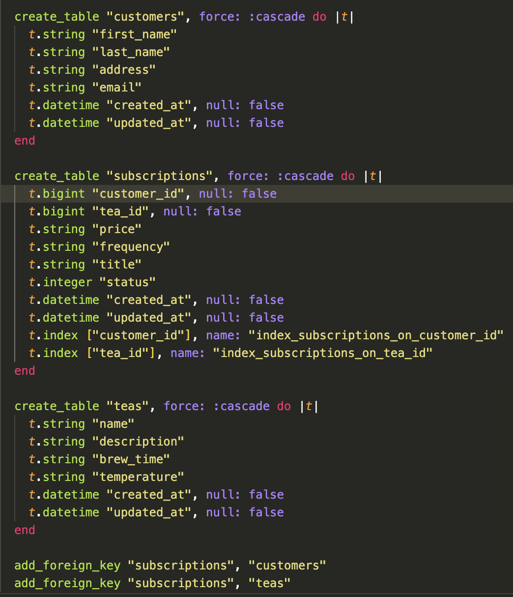

# README


# Welcome to "To A Tea"
- this application functions as a BE API for a tea subscription service. It allows customers to create tea subscriptions, cancel those subscriptions, and will give a list of tea subscriptions made by the customer.

### Setup
- clone the repo and create the database:

```
$ git clone git@github.com:tmitchellisaac/To_A_Tea.git
$ cd to_a_tea

$ rails db:create
$ rails db:migrate
```

### Versions
- This application is currently on `V1`
- The Ruby version used is `ruby 3.2.2`
- The Rails version used is `Rails 7.1.3.2`

### Test Coverage
- to view the test coverage using the `simplecov` gem, run the full test suite `bundle exec rspec` from the root directory. Then run `open coverage/index.html`

## JSON contract

#### This application currently has three endpoints

1. Creating a Subscription for a Customer

- endpoint: `POST "api/v1/customers/customer_id/subscriptions"`

- with a JSON body of:

```
{
  tea_id: 2,
  frequency: 1,
  price: 1400,
  title: "Weekly Camomille"
}
```
- Which will yield a response similar to :
```
{
    "data": {
        "id": "3",
        "type": "subscription",
        "attributes": {
            "price": "1400",
            "frequency": "1",
            "title": "Weekly Camomille",
            "status": "active",
            "customer_id": 1,
            "tea_id": 1
        },
        "relationships": {
            "customer": {
                "data": {
                    "id": "1",
                    "type": "customer"
                }
            },
            "tea": {
                "data": {
                    "id": "1",
                    "type": "tea"
                }
            }
        }
    }
}
```

2. Cancelling a Subscription

- endpoint: `PATCH "api/v1/customers/customer_id/subscriptions/subscription_id?status=cancelled"`

- Which will yield a response of:

```
{"success": "Subscription Successfully Cancelled"}
```

3. Listing all a customer's subscriptions

- endpoint: `GET "api/v1/customers/customer_id/subscriptions"`

Which will yield a response similar to:

```
{
    "data": [
        {
            "id": "1",
            "type": "subscription",
            "attributes": {
                "price": "1400",
                "frequency": "1",
                "title": "Weekly Camomille",
                "status": "cancelled",
                "customer_id": 1,
                "tea_id": 1
            },
            "relationships": {
                "customer": {
                    "data": {
                        "id": "1",
                        "type": "customer"
                    }
                },
                "tea": {
                    "data": {
                        "id": "1",
                        "type": "tea"
                    }
                }
            }
        },
        {
            "id": "2",
            "type": "subscription",
            "attributes": {
                "price": "1400",
                "frequency": "1",
                "title": "Weekly Camomille",
                "status": "active",
                "customer_id": 1,
                "tea_id": 1
            },
            "relationships": {
                "customer": {
                    "data": {
                        "id": "1",
                        "type": "customer"
                    }
                },
                "tea": {
                    "data": {
                        "id": "1",
                        "type": "tea"
                    }
                }
            }
        }
    ]
}
```
## Schema-

